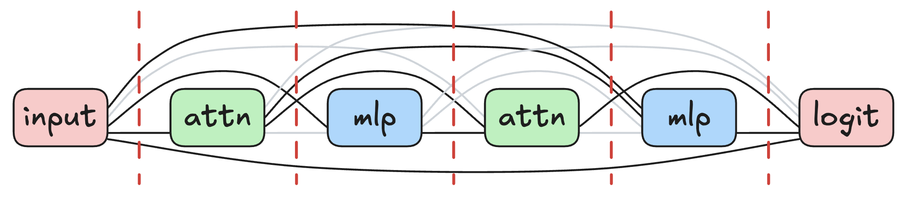

# Demystifying Variance in Circuit Discovery of LLMs

This repository contains the code and minimal reproduction artifacts for
[Demystifying Variance in Circuit Discovery of LLMs](https://openreview.net/forum?id=oPmRcjTip0).



The circuit discovery code builds on a line of methods for automated circuit
discovery and edge-level attribution, including
[ACDC](https://github.com/ArthurConmy/Automatic-Circuit-Discovery),
[EAP](https://arxiv.org/abs/2310.10348), and
[EAP-IG](https://github.com/hannamw/eap-ig). In particular, this repo includes
a standalone CEAP implementation for scoring transformer components and
selecting circuits, plus experiment scripts for studying resampling,
rephrasing, and samplewise variance.

## Environment Setup

The following commands create a Conda environment that can run all the code in this repository.

```bash
conda create -y -n ceap python=3.10
conda activate ceap
conda install -y -c conda-forge graphviz pygraphviz=1.14
pip install -r requirements.txt
cd CEAP
pip install -e .
cd ..
```

For subsequent sessions:

```bash
conda activate ceap
```

## Code Architecture

### CEAP Package

The `CEAP/ceap` directory is a shippable implementation of CEAP. It can be
installed with `pip install -e .` from `CEAP/` and reused independently of the
paper-specific experiment scripts.

- `CEAP/ceap/graph.py` defines the graph abstraction used for circuit discovery:
  nodes, edges, TransformerLens hook locations, top-n and greedy edge selection, etc.
- `CEAP/ceap/attribute.py` implements edge attribution for `ceap`, `eap-ig`,
  and `eap`.
- `CEAP/ceap/evaluate_graph.py` evaluates selected circuits by patching edges
  outside the circuit with corrupted activations and returning metric values
  used to compute circuit faithfulness.
- `CEAP/ceap/utils.py` contains small utilities shared by the CEAP package, such
  as graph colors and model-family resolution.

`minimal_ceap_greedy_selection.ipynb` gives a minimal working example of how to
score a graph with CEAP and select a circuit with greedy search.

### Plot Reproduction Artifacts

The scripts below are minimal artifacts for reproducing important
visualizations from the paper. Running the full paper sweep is compute-heavy.
The examples in this repo investigate `gpt2` on SVA with 20 integrated-gradient steps.
Visualizations for other tasks or models can be generated by changing the arguments passed to the experiment scripts.

The paper figures were generated with more integrated-gradient steps: 200 steps
for GPT-2 and Pythia models, and 150 steps for sparse models from
[Gao et al. (2025)](https://arxiv.org/abs/2511.13653).

- `pareto_variance.py` and `pareto_variance_example.sh` reproduce the
  resampling-variance plots. The example runs four seeds for CEAP and EAP-IG,
  then calls `visualization/plot_resampling_variance.py`. On the default
  `gpt2`/SVA setting, this should take less than one hour on a single NVIDIA A100
  40GB GPU.

```bash
bash pareto_variance_example.sh
```

- `pareto_single_sample_analysis.py`,
  `pareto_single_sample_scoring_eval.py`, and
  `pareto_single_sample_example.sh` reproduce the rephrasing and samplewise
  variance plots. The driver launches per-sample scoring subprocesses, gathers
  the results, and calls `visualization/plot_rephrasing_samplewise_variance.py`.
  On the default `gpt2`/SVA setting, this should take less than one hour on a
  single NVIDIA A100 40GB GPU.

```bash
bash pareto_single_sample_example.sh
```

The `visualization/` directory contains plotting-only scripts. Generated plots
are written under `visualization/outputs/`.

### Datasets

The datasets are probing prompts for circuit discovery and can be reused for
other experiments.

- `data/` contains SVA, IOI, and greater-than prompts. These are refined from
  the data implementation in
  [hannamw/eap-ig-faithfulness](https://github.com/hannamw/eap-ig-faithfulness)
  for reproducibility and more detailed labeling information.
- `data_sparsity/` contains newly created TinyPython datasets for sparse models
  from [Gao et al. (2025)](https://arxiv.org/abs/2511.13653): `else_elif` and
  `single_double_quote`.

### Sparse-Model Logistics

- `circuit_sparsity_assets/` vendors the minimal TinyPython tokenizer assets
  needed for loading circuit-sparsity checkpoints.
- `circuit_sparse_adapter.py` provides a TransformerLens-compatible adapter for
  released circuit-sparsity models. TransformerLens does not support the sparse
  models from [Gao et al. (2025)](https://arxiv.org/abs/2511.13653)
  out-of-the-box, and this file bridges that gap.
- `clear_circuit_sparse_cache.py` deletes cached circuit-sparsity model blobs
  used by the adapter.

### Other Helper Modules

- `dataset.py` defines dataset and dataloader helpers used to prompt models.
- `metrics.py` centralizes task metrics used for attribution, circuit selection,
  and circuit evaluation.
- `pareto_dev_utils.py` contains shared experiment utilities.
- `numpy_core_compat.py` provides a compatibility shim for loading pickles that
  reference historical `numpy._core` module names.

## Citation

```bibtex
@inproceedings{
wu2026demystifying,
title={Demystifying Variance in Circuit Discovery of {LLM}s},
author={Frank Zhengqing Wu and Francesco Tonin and Volkan Cevher},
booktitle={Mechanistic Interpretability Workshop at ICML 2026},
year={2026},
url={https://openreview.net/forum?id=oPmRcjTip0}
}
```
